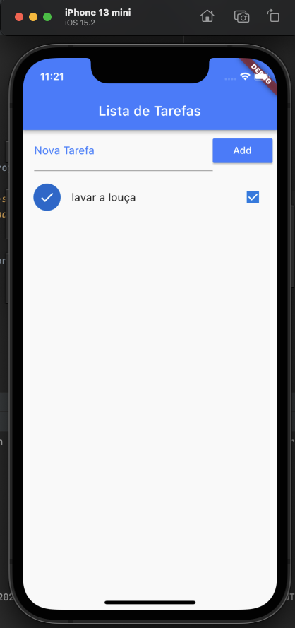
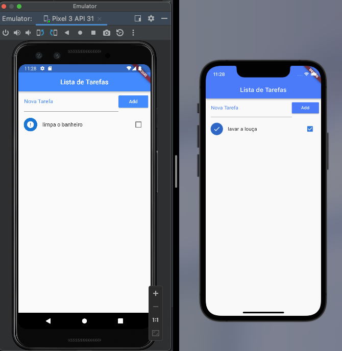

# to-doList

## Description

Studying a bit of Flutter

## Preview

| Iphone 13 Mini | Pixel 3 |
| ---- | ---- |  
|  | 

## Getting Started
1. Clone project `git@github.com:DaniloP85/to-doList.git` or  `https://github.com/DaniloP85/to-doList`
2. Open the project in Android Studio or VSCode

[curso-completo-flutter-app-android-ios](https://www.udemy.com/course/curso-completo-flutter-app-android-ios/)

## Authors

[Danilo Santos](https://www.linkedin.com/in/danilopsnts/)

## Contributing

Please read [CONTRIBUTING](CONTRIBUTING.md) for details on our code of conduct, and the process for submitting pull requests to us.
## License

This project is licensed under the MT License - see the [LICENSE](LICENSE.md) file for details